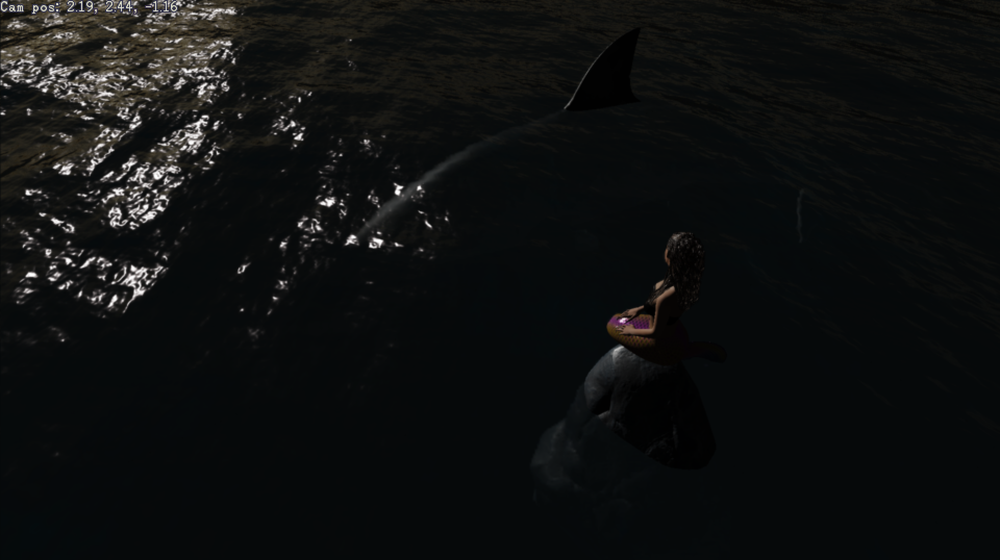

# OpenGL Ocean




OpenGL ocean rendered with tessellation shaders and the Fast Fourier Transform library, GLFFT.

```
git clone https://github.com/livinamuk/GLOcean.git
```

Never quit, never waver 🌹
